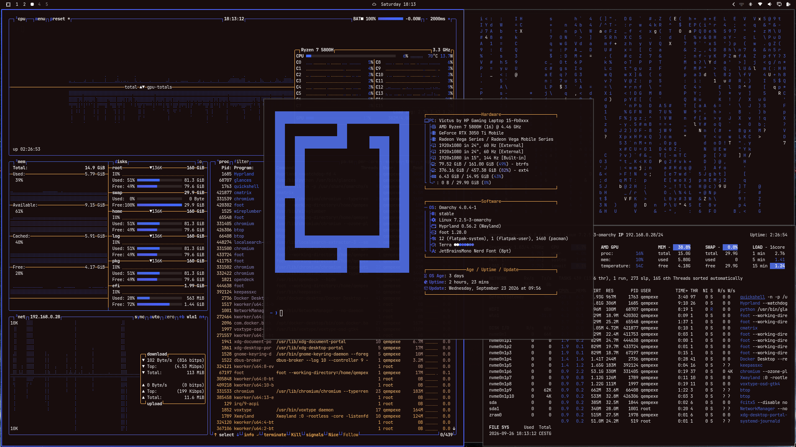

# Terra Theme for Omarchy

A dark, space-inspired Omarchy theme built with [Aether](https://github.com/bjarneo/aether) - a near-black background paired with a spread of vivid accent colors extracted from the wallpaper.



## Installation

```
omarchy-theme-install https://github.com/qempexe/omarchy-terra-theme.git
```

## Backgrounds

Wallpaper(s) sourced from Wallpaper Access. See `backgrounds/` for the full set.

## Acknowledgments

This theme was created using [Aether](https://github.com/bjarneo/aether) by [@bjarneo](https://github.com/bjarneo).

## License

The MIT license (see LICENSE) applies to this repository's theme configuration files (colors.toml, icons.theme, etc.) only.

The background image(s) in backgrounds/ are not covered by the MIT license - they are sourced from Wallpaper Access and included as-is; rights belong to their original creators.
